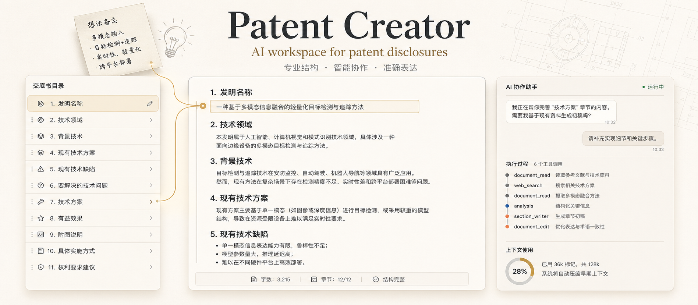

<h1 align="center">Patent Creator</h1>

<p align="center">
  <a href="#当前状态"></a>
  <a href="#设计理念"></a>
  <a href="#工作方式"></a>
  <a href="#本地体验"></a>
  <a href="LICENSE"></a>
</p>



Patent Creator 是一个面向专利交底书写作的人工智能协作工作台。

它不是一个简单的聊天框，也不是一个空白文档编辑器。它试图把“发明人脑子里的想法”“专利文档需要的结构”和“多轮推敲后的正式表达”连接起来，让人工智能不只是回答问题，而是持续参与一份交底书的形成过程。

## 为什么需要它

很多发明想法在最初并不是一份完整文档，而是一些零散描述：

- 这个方案解决了什么问题？
- 和现有方案相比，关键差异在哪里？
- 技术效果怎么说得更清楚？
- 哪些内容应该写进背景，哪些内容应该写进技术方案？
- 权利要求应该围绕什么创新点展开？

传统写作方式里，这些信息需要反复整理、拆分、归纳和改写。本项目希望把这件事变成一个连续的协作过程：你不断补充想法，系统持续理解上下文、完善章节，并让文档逐步变得像一份真正的专利交底书。

## 它能做什么

- 将零散发明想法整理成专利交底书结构
- 按章节补写、改写和润色技术内容
- 帮助识别技术问题、技术方案、创新点和技术效果
- 在多轮对话中保留上下文，不把每次输入都当成孤立问题
- 展示人工智能的处理过程，让用户知道它读了什么、改了什么、为什么这么做
- 维护一份持续更新的交底书预览，而不是只给一次性回答

## 工作方式

本项目的核心体验是三件事同时发生：

1. 你用自然语言描述需求  
   可以是一句话、一个技术方向、一段草稿，也可以是“帮我把技术方案写完整”。

2. 人工智能阅读当前文档并规划修改  
   系统会结合当前章节、历史会话和文档内容判断下一步该做什么。

3. 交底书被持续更新  
   结果会落到文档预览中，用户可以继续追问、补充、调整方向。

这使它更像一个陪你写交底书的协作系统，而不是只会生成一段文本的工具。

## 适合谁

- 正在整理发明点的研发人员
- 需要把技术方案转成专利交底材料的产品或技术负责人
- 希望快速形成交底书初稿的专利工程师
- 想探索智能体在专业文档写作中如何落地的人

## 设计理念

### 文档不是一次生成的

专利交底书往往需要多轮澄清、补充和修正。本项目更关注“持续协作”，而不是一次性生成一份看似完整但难以追溯的文档。

### 人工智能应该能看见过程

系统会展示关键执行过程，例如读取章节、调用工具、调度子任务和写回文档。这样用户不仅看到结果，也能理解结果是怎么来的。

### 结构比灵感更重要

好的交底书不只是语言流畅，还要结构清晰。本项目从一开始就围绕发明名称、技术领域、背景技术、技术方案、技术效果、权利要求建议等章节组织内容。

### 本地优先

运行数据默认保存在用户本机目录中，适合本地试验、迭代和调试。你可以清楚知道文档、会话和导出结果放在哪里。

## 当前状态

本项目目前处于本地原型阶段，已经具备基础的交底书协作写作体验：

- 可视化交底书预览
- 多轮智能体对话
- 会话记录与切换
- 文档章节读写
- 工具调用过程展示
- 上下文窗口管理
- 本地文件工作区

它还不是一个完整的商业化专利系统，但已经可以作为智能体专业写作工作流的实验场。

## 本地体验

复制配置文件：

```bash
cp env.example .env
```

填写模型密钥后启动：

```bash
./scripts/start-dev.sh
```

默认打开：

```text
http://127.0.0.1:5173
```

运行数据默认保存在：

```text
~/.patent_creator
```

## 后续规划

- 更自然的项目与会话管理
- 更完整的资料阅读和引用能力
- 更强的专利语言风格控制
- 导出正式文档格式
- 人工编辑与智能体修改的协同
- 面向不同技术领域的写作策略

## 开源许可

本项目基于 [MIT License](LICENSE) 开源。

## 一句话

本项目想做的是：让人工智能从“帮我写一段”走向“陪我完成一份专业文档”。
