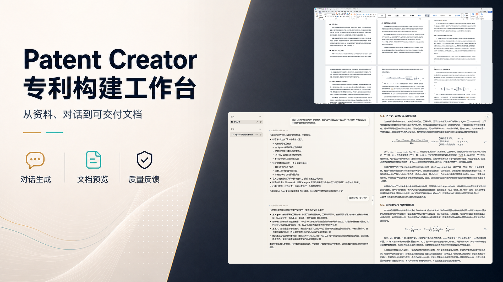

# Patent Creator

<p>
  <a href="https://github.com/HappyThis/patent_creator/releases"></a>
  <a href="LICENSE"></a>
  
  
  
</p>



Patent Creator 是一个面向专利交底书写作的 AI Agent 工作台：从项目资料和对话生成可预览、可修订、可导出的 DOCX 文档。

它不是普通聊天机器人，也不是空白文档编辑器。用户通过对话说明目标，Agent 负责阅读材料、规划章节、调用工具、写入正文和持续修订；用户主要判断方向、补充事实和提出修改意见。

> 当前项目仍处于本地原型阶段，重点验证 Agent 写作工作流、交底书结构化编辑、公式/附图预览和 DOCX 导出链路。

## 为什么需要

专利交底书写作经常不是从完整文档开始，而是从分散材料开始：

- 项目代码、研发资料、产品说明里有技术细节，但缺少专利表达。
- 发明人知道做了什么，但很难组织成背景技术、技术问题、技术方案和实施方式。
- 多轮修改容易散落在聊天记录里，最终文档和对话上下文脱节。
- 公式、附图、章节结构和 DOCX 导出需要保持一致，不能只停留在纯文本草稿。

Patent Creator 关注的是中间地带：把想法、资料和对话推进成结构化交底书。

## 快速开始

复制配置文件：

```bash
cp env.example .env
```

填写 `.env` 中的模型配置，至少需要：

```text
OPENAI_BASE_URL=https://api.openai.com/v1
OPENAI_API_KEY=your_api_key
OPENAI_MODEL=gpt-5.5
```

启动前后端：

```bash
./scripts/start-dev.sh
```

Windows PowerShell：

```powershell
.\scripts\start-dev.ps1
```

默认访问：

```text
http://127.0.0.1:5173
```

运行数据默认保存在：

```text
~/.patent_creator
```

## 核心能力

- 对话驱动写作：用户用 chat 指挥 Agent，不需要在复杂表单里拆任务。
- 项目与会话管理：侧边栏管理项目、会话和运行状态。
- Agent 过程记录：展示工具调用、上下文压缩、内容增强和文本输出等过程。
- 交底书预览：右侧预览当前交底书正文，便于持续检查。
- 章节级编辑：Agent 可以围绕章节写入、补充、替换和重排内容。
- 公式与附图：支持块级公式、行内公式、Mermaid 附图和正文引用。
- DOCX 导出：从当前交底书状态导出 Word 文档，而不是从聊天记录拼接文本。
- Benchmark 反馈：用固定案例、重复运行和评估结果反推写作链路质量。

## 真实演示

封面图来自当前项目的一次真实自举演示：Patent Creator 读取演示项目材料，通过对话生成专利交底书草稿，并展示工作台预览与 Word/DOCX 导出效果。

这条演示链路覆盖了三个关键动作：

1. 用户在项目会话中描述写作目标。
2. Agent 阅读项目材料并写入交底书章节。
3. 交底书正文、公式、编号和多页排版导出到 DOCX。

## 工作流

1. 创建项目，放入资料、代码或说明文档。
2. 在会话中描述发明方向或写作目标。
3. Agent 阅读项目材料，生成或修订交底书章节。
4. 用户通过预览检查正文、公式、附图和结构。
5. 继续用对话补充事实、要求重写或细化章节。
6. 导出 DOCX，得到可进一步交付或审阅的文档。

## 工程特点

Patent Creator 把“让 Agent 写好交底书”当作工程问题处理，而不只是一次 prompt 生成。

- Agent loop：主 Agent 在多轮循环中读取上下文、选择工具、观察结果并继续决策。
- 状态可追踪：过程记录、工具结果、压缩事件和最终文档状态都会沉淀。
- 文档状态优先：写作结果落到交底书结构中，预览和导出基于同一份文档状态。
- 质量反馈闭环：通过 benchmark case、重复运行和评估快照比较策略效果。

## Benchmark

Benchmark 用来衡量 Agent 是否能从代码、资料或描述中形成稳定、准确、有专利价值的技术方案。评估重点不只是生成字数，而是是否识别真实技术问题、抓住关键创新机制、形成可实施且可保护的技术方案。

| Benchmark | 结果 ID | 规模 | 平均分 | 通过情况 | 备注 |
| --- | --- | --- | --- | --- | --- |
| 专利技术方案 benchmark | `20260619-gpt55-baseline-10cases-5x-w10` | 10 cases x 5 repeats | 93.14 / 100 | 50/50 scored，artifact_success=50/50 | subject=`gpt-5.5`，judge=`codex`，workers=10 |

这个分数用于说明当前写作链路的大致表现，不代表最终产品能力上限。

## Roadmap

- 增强复杂图片生成和附图管理。
- 改进 DOCX 导出的视觉校准和更多真实样本文档验证。
- 加强网页资料读取、引用管理和来源追踪。
- 增强专利语言风格控制和章节结构约束。
- 扩展 benchmark 覆盖范围，持续验证多轮写作稳定性。

## 技术栈

- Backend：Python 3.11+、FastAPI、OpenAI SDK、python-docx。
- Frontend：React、Vite、TypeScript、KaTeX、Mermaid。
- Dev workflow：`scripts/start-dev.sh` 和 `scripts/start-dev.ps1` 一键启动本地开发环境。

## 开源许可

本项目基于 [MIT License](LICENSE) 开源。

## 一句话

Patent Creator 想做的是：让用户从“我有一个想法”开始，通过指挥 Agent，逐步完成一份结构清晰、证据可追踪、可以导出的专利交底书。
